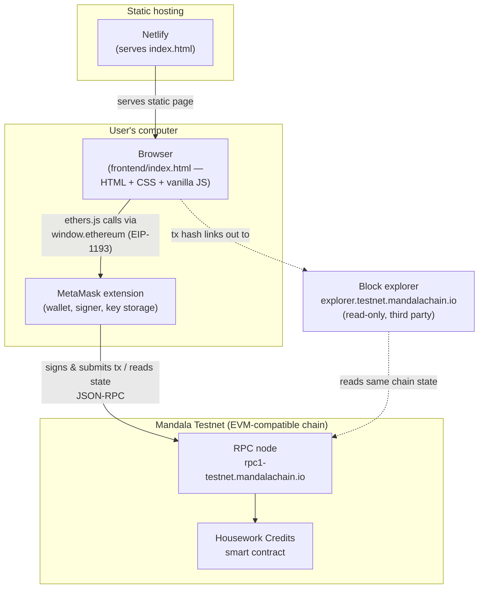

# System Design

## 1. Overview

Housework Credits is a **fully on-chain** dApp: there is no backend server and no
off-chain database. The browser talks directly to the user's wallet (MetaMask),
which talks directly to the blockchain. All application state — account
balances and transaction history — lives in the smart contract's storage and
event log on Mandala Testnet.

## 2. Architecture diagram

**Notes**

- The frontend never talks to the RPC node directly for *sending* transactions —
  MetaMask is always the intermediary, since it holds the private keys and signs
  every transaction.
- The frontend *does* use the RPC (through MetaMask's injected provider) for
  read-only calls: account list, balances, account names, and historical
  `CreditsSent` events (`eth_getLogs`).
- There is no application server. Hosting (Netlify) only serves a static file;
  it has no role in the app's logic.

## 3. Components

| Component | Responsibility |
|---|---|
| `frontend/index.html` | UI, wallet connection, network switching, reading balances/history, building transactions |
| MetaMask | Key custody, transaction signing, network/account switching, user consent prompts |
| Mandala Testnet RPC | Executes reads, broadcasts signed transactions, serves event logs |
| Smart contract | Source of truth for account list, balances, and the `CreditsSent` event log |
| Netlify | Static file hosting only |
| Block explorer | Independent, human-facing verification of any transaction/address (not used programmatically by the app) |

## 4. Data model ("database design")

**There is no off-chain database.** All persistent state is on-chain, inside the
smart contract. The frontend holds no state of its own beyond what's currently
loaded into memory in the browser tab (it re-fetches everything on connect).

The contract's data model, as used by the frontend (see `contract/ABI.json`):

| On-chain state | Exposed via | Shape |
|---|---|---|
| Fixed list of 3 accounts | `getAllAccounts() → address[3]` | 3 hardcoded wallet addresses (Mom, Dad, Kid) |
| Human-readable name per account | `nameOf(address) → string` | e.g. `0x41B3... → "Mom"` |
| Current credit balance per account | `getAllBalances() → uint256[3]` | raw integers, no decimals, no monetary value |
| Full transaction history | `event CreditsSent(from, to, amount, reason)` | not stored in contract storage — reconstructed by querying past event logs (`eth_getLogs`) |

Two important consequences of this design, worth knowing before extending the
system:

1. **The account list is fixed at 3 and hardcoded in the contract.** Adding a
   4th family member means changing and redeploying the contract — the
   frontend has no concept of "add account".
2. **"Transaction history" is not stored — it's derived** by replaying the
   `CreditsSent` events from block 0 to the latest block. This is why the
   frontend has to paginate/chunk `eth_getLogs` calls (the public RPC rejects
   overly large block ranges in one request) — see `docs/HANDOVER.md`.

## 5. Credits vs. KPGT — two separate value systems

This trips up newcomers, so it's worth stating explicitly:

- **KPGT** is the native currency of Mandala Testnet (like ETH on Ethereum). It
  pays gas fees for every transaction. It is *not* defined by this project's
  contract — it's a property of the chain itself.
- **"Credits"** are a bespoke integer ledger inside this specific contract.
  They are **not an ERC-20 token** — no `name()`/`symbol()`/`decimals()`/
  `transfer()`/`approve()`, so MetaMask cannot display them in its normal
  "Tokens" tab. They only exist and are only visible through this app's UI.

Every account still needs its own small KPGT balance to pay gas, even though
KPGT and credits are unrelated — this is the single most common "why can't I
send" issue encountered during development (see `docs/HANDOVER.md`).
