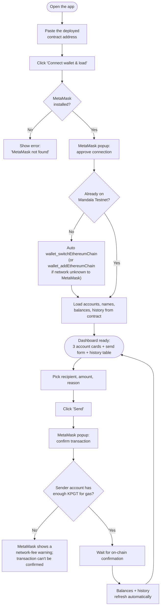
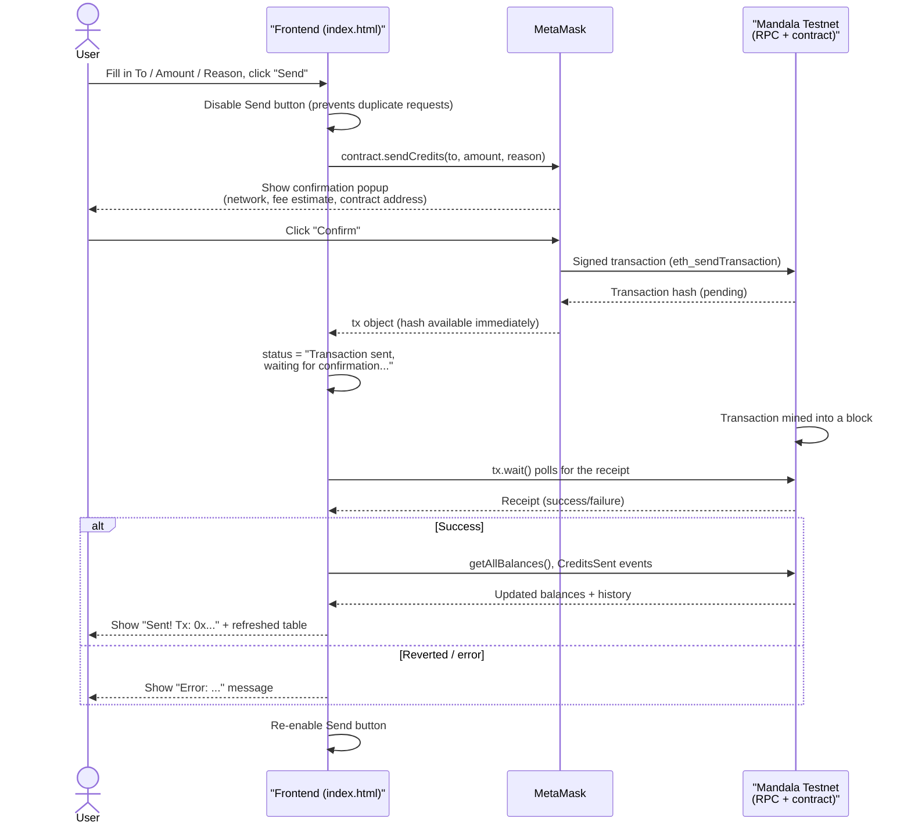

# User Flow

## 1. Overall journey (flowchart)

## 2. Sequence diagram — sending credits

This is the core action of the app. It involves four actors: the person, the
page's JavaScript, the MetaMask extension, and the blockchain (RPC + contract).

## 3. Notes for the next developer

- **Every wallet approval is a real, separate user action.** There are two
  distinct MetaMask popups in a full "connect + send" cycle: one to approve
  the site connection (`eth_requestAccounts`), one to approve each
  transaction. Neither can be skipped or auto-approved by the frontend.
- **Nothing happens silently.** If a popup doesn't visibly appear, it's
  usually still pending — check the MetaMask extension icon for a badge/dot.
  This was the single most common source of confusion during testing (see
  `docs/HANDOVER.md`).
- **The account currently active in MetaMask is always the sender.** The "To"
  dropdown only controls the recipient; there is no way to pick a different
  sender from the page itself — the user must switch accounts inside MetaMask
  and reload the page.
